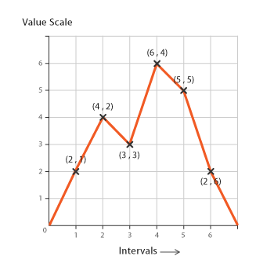

  

<h1 align="center">
 Estatistica Aplicada a Computação
</h1>

## :clipboard: Descrição
Repositorio desenvolvido durante o segundo periodo do curso de Eng Da Computação no IFPB-Campus Campina Grande. Na disciplina de Estatitisca Aplicada a computação.

## :books: Fundamentação
O objetivo da disciplina era a analise de dados e geração de graficos para responder perguntas. Foi utilizando python 3, com bibliotecas expecificas para analise de dados. Durante
a disciplina, analisamos dados da policia federal(acidentes e controle de trafego), dados de postos de combustiveis e dados do Titanic.

## 🧐 O que tem dentro?

### Tecnologias
- [Python 3](https://www.python.org/downloads/)
- [Biblioteca Numpy](https://numpy.org)
- [Biblioteca Pandas](https://pandas.pydata.org)
- [Biblioteca matplotlib](https://matplotlib.org)

### Ferramentas de Linter
- [Jupyter Notebook](https://jupyter.org)

